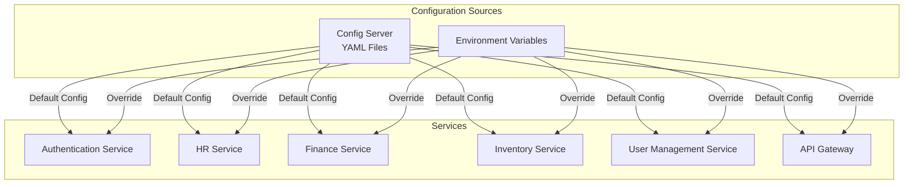
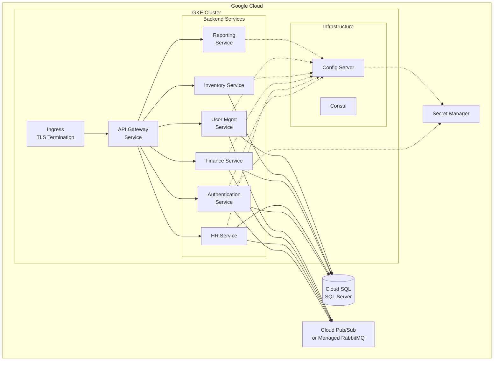

# Configuration Guide

This guide explains how to configure the KonectaERP application for local development and production deployment on Google Kubernetes Engine (GKE).

## Table of Contents

- [Architecture Overview](#architecture-overview)
- [Local Development Setup](#local-development-setup)
- [Production Deployment on GKE](#production-deployment-on-gke)
- [Environment Variables Reference](#environment-variables-reference)
- [Configuration Precedence](#configuration-precedence)
- [Security Best Practices](#security-best-practices)
- [Troubleshooting](#troubleshooting)

## Architecture Overview

KonectaERP uses a **Spring Cloud Config Server** for centralized configuration management:



### Configuration Strategy

1. **Config Server** stores service-specific YAML files with default/development values
2. **Environment Variables** override config server values for production deployment
3. **Profile-based Configuration**: Services can load different profiles (default, production)

### Key Components

- **Config Server**: Centralized configuration at `backend/config/src/main/resources/config/`
- **.NET Services**: Minimal `appsettings.json` files that defer to config server
- **Frontend**: TypeScript environment files for Angular
- **Docker Compose**: Local development orchestration

## Local Development Setup

### Prerequisites

- Docker and Docker Compose
- .NET 8 SDK (for running services outside Docker)
- Node.js 18+ (for frontend development)

### Quick Start

1. **Copy the local environment template:**

   ```bash
   cp .env.local.example .env
   ```

2. **Review and customize** `.env` if needed (optional for local dev)

3. **Start all services:**

   ```bash
   docker compose up
   ```

4. **Access the application:**
   - Frontend: http://localhost:4200
   - API Gateway: http://localhost:8080
   - RabbitMQ Management: http://localhost:15672 (guest/guest)
   - MailHog UI: http://localhost:8025
   - Consul UI: http://localhost:8500

### Local Configuration Details

For local development, the config server provides all necessary configuration with sensible defaults:

- **Database**: SQL Server running in Docker (password: `pa55w0rd!`)
- **Message Broker**: RabbitMQ (guest/guest)
- **Email**: MailHog (catches all emails, no real sending)
- **Service Discovery**: Consul
- **JWT Keys**: Hardcoded in config server (NOT for production)

### Running Services Individually

If you need to run services outside Docker for debugging:

1. **Start infrastructure services:**

   ```bash
   docker compose up sqlserver rabbitmq mailhog consul-server config-server
   ```

2. **Set environment variables:**

   ```bash
   export ASPNETCORE_ENVIRONMENT=Development
   export SPRING__CLOUD__CONFIG__URI=http://localhost:8888
   export Consul__Host=http://localhost:8500
   ```

3. **Run the service:**
   ```bash
   cd backend/AuthenticationService
   dotnet run
   ```

## Production Deployment on GKE

### Prerequisites

- Google Cloud Project with billing enabled
- GKE cluster created
- `gcloud` CLI installed and configured
- `kubectl` configured for your cluster

### Architecture on GKE



### Step 1: Set Up Google Cloud Resources

#### 1.1 Create Cloud SQL Instance

```bash
# Create SQL Server instance
gcloud sql instances create konecta-db \
    --database-version=SQLSERVER_2022_STANDARD \
    --tier=db-custom-2-7680 \
    --region=us-central1 \
    --root-password=<STRONG_PASSWORD>

# Create databases
gcloud sql databases create Konecta_Auth --instance=konecta-db
gcloud sql databases create Konecta_HR --instance=konecta-db
gcloud sql databases create Konecta_Finance --instance=konecta-db
gcloud sql databases create Konecta_Inventory --instance=konecta-db
gcloud sql databases create Konecta_UserManagement --instance=konecta-db
```

#### 1.2 Set Up Secret Manager

```bash
# Enable Secret Manager API
gcloud services enable secretmanager.googleapis.com

# Create secrets
gcloud secrets create db-connection-string \
    --data-file=- <<EOF
Server=<CLOUD_SQL_IP>,1433;Database=Konecta_Auth;User Id=sqlserver;Password=<DB_PASSWORD>;TrustServerCertificate=True;
EOF

# Generate JWT keys
openssl genrsa -out private.pem 2048
openssl rsa -in private.pem -pubout -out public.pem

# Store JWT keys
gcloud secrets create jwt-private-key --data-file=private.pem
gcloud secrets create jwt-public-key --data-file=public.pem

# Create service shared secret
openssl rand -base64 32 | gcloud secrets create service-shared-secret --data-file=-
```

#### 1.3 Configure Message Broker

**Option A: Use Cloud Pub/Sub** (Recommended for GKE)

```bash
# Enable Pub/Sub API
gcloud services enable pubsub.googleapis.com

# Create topics
gcloud pubsub topics create konecta-erp
```

**Option B: Deploy RabbitMQ on GKE**

```bash
# Use Helm to deploy RabbitMQ
helm repo add bitnami https://charts.bitnami.com/bitnami
helm install rabbitmq bitnami/rabbitmq \
    --set auth.username=admin \
    --set auth.password=<STRONG_PASSWORD>
```

### Step 2: Configure Kubernetes Secrets

Create a Kubernetes secret with all sensitive configuration:

```bash
# Create namespace
kubectl create namespace konecta-erp

# Create secret from .env file
kubectl create secret generic konecta-config \
    --from-literal=DB_CONNECTION_STRING="Server=<IP>,1433;Database=Konecta_Auth;User Id=sa;Password=<PWD>;TrustServerCertificate=True;" \
    --from-literal=RABBITMQ_HOST="<RABBITMQ_HOST>" \
    --from-literal=RABBITMQ_USERNAME="<USERNAME>" \
    --from-literal=RABBITMQ_PASSWORD="<PASSWORD>" \
    --from-literal=SMTP_HOST="<SMTP_HOST>" \
    --from-literal=SMTP_PORT="587" \
    --from-literal=SMTP_USERNAME="<SMTP_USER>" \
    --from-literal=SMTP_PASSWORD="<SMTP_PWD>" \
    --from-literal=JWT_PRIVATE_KEY="$(cat private.pem)" \
    --from-literal=JWT_PUBLIC_KEY="$(cat public.pem)" \
    --from-literal=SERVICE_SHARED_SECRET="<SECRET>" \
    --namespace=konecta-erp
```

**OR** use Google Secret Manager with Workload Identity:

```yaml
apiVersion: v1
kind: ServiceAccount
metadata:
  name: konecta-sa
  namespace: konecta-erp
  annotations:
    iam.gke.io/gcp-service-account: konecta-sa@<PROJECT_ID>.iam.gserviceaccount.com
```

### Step 3: Deploy Services to GKE

#### 3.1 Build and Push Docker Images

```bash
# Set your GCP project and region
export PROJECT_ID=<your-project-id>
export REGION=us-central1

# Configure Docker for GCR
gcloud auth configure-docker ${REGION}-docker.pkg.dev

# Build and push images
docker build -t ${REGION}-docker.pkg.dev/${PROJECT_ID}/konecta/config-server:latest -f backend/config/Dockerfile backend/config
docker push ${REGION}-docker.pkg.dev/${PROJECT_ID}/konecta/config-server:latest

docker build -t ${REGION}-docker.pkg.dev/${PROJECT_ID}/konecta/api-gateway:latest -f backend/ApiGateWay/Dockerfile backend/ApiGateWay
docker push ${REGION}-docker.pkg.dev/${PROJECT_ID}/konecta/api-gateway:latest

docker build -t ${REGION}-docker.pkg.dev/${PROJECT_ID}/konecta/authentication-service:latest -f backend/AuthenticationService/Dockerfile .
docker push ${REGION}-docker.pkg.dev/${PROJECT_ID}/konecta/authentication-service:latest

# Repeat for other services...
```

#### 3.2 Create Kubernetes Deployments

Example deployment for Authentication Service:

```yaml
apiVersion: apps/v1
kind: Deployment
metadata:
  name: authentication-service
  namespace: konecta-erp
spec:
  replicas: 2
  selector:
    matchLabels:
      app: authentication-service
  template:
    metadata:
      labels:
        app: authentication-service
    spec:
      serviceAccountName: konecta-sa
      containers:
        - name: authentication-service
          image: ${REGION}-docker.pkg.dev/${PROJECT_ID}/konecta/authentication-service:latest
          ports:
            - containerPort: 7280
          env:
            - name: ASPNETCORE_ENVIRONMENT
              value: "Production"
            - name: SPRING__CLOUD__CONFIG__URI
              value: "http://config-server:8888"
            - name: SPRING__CLOUD__CONFIG__PROFILE
              value: "production"
            - name: Consul__Host
              value: "http://consul-server:8500"
          envFrom:
            - secretRef:
                name: konecta-config
          resources:
            requests:
              memory: "512Mi"
              cpu: "250m"
            limits:
              memory: "1Gi"
              cpu: "500m"
---
apiVersion: v1
kind: Service
metadata:
  name: authentication-service
  namespace: konecta-erp
spec:
  selector:
    app: authentication-service
  ports:
    - port: 7280
      targetPort: 7280
  type: ClusterIP
```

#### 3.3 Configure Ingress with TLS

```yaml
apiVersion: networking.k8s.io/v1
kind: Ingress
metadata:
  name: konecta-ingress
  namespace: konecta-erp
  annotations:
    kubernetes.io/ingress.class: "gce"
    cert-manager.io/cluster-issuer: "letsencrypt-prod"
spec:
  tls:
    - hosts:
        - api.yourdomain.com
      secretName: konecta-tls
  rules:
    - host: api.yourdomain.com
      http:
        paths:
          - path: /
            pathType: Prefix
            backend:
              service:
                name: api-gateway
                port:
                  number: 8080
```

### Step 4: Environment-Specific Configuration

For production, ensure these environment variables are set:

```bash
# In Kubernetes deployment manifests
ASPNETCORE_ENVIRONMENT=Production
SPRING__CLOUD__CONFIG__PROFILE=production
JWT_REQUIRE_HTTPS=true
SERVICE_SCHEME=https
CONSUL_REGISTER=true
```

## Environment Variables Reference

See [.env.example](.env.example) for a complete list of all environment variables with descriptions.

### Critical Variables for Production

| Variable                | Description                         | Example                                          |
| ----------------------- | ----------------------------------- | ------------------------------------------------ |
| `DB_CONNECTION_STRING`  | SQL Server connection string        | `Server=10.0.0.1,1433;Database=Konecta_Auth;...` |
| `JWT_PRIVATE_KEY`       | RSA private key for JWT signing     | PEM format                                       |
| `JWT_PUBLIC_KEY`        | RSA public key for JWT verification | PEM format                                       |
| `SERVICE_SHARED_SECRET` | Secret for service-to-service auth  | Random 32+ char string                           |
| `RABBITMQ_PASSWORD`     | Message broker password             | Strong password                                  |
| `SMTP_PASSWORD`         | Email service password              | SMTP password                                    |

## Configuration Precedence

Configuration values are resolved in the following order (highest to lowest priority):

1. **Environment Variables** (highest priority)
2. **appsettings.{Environment}.json** (.NET services)
3. **Config Server** (service-specific YAML)
4. **appsettings.json** (lowest priority)

### Example

For the `ConnectionStrings:DefaultConnection` setting:

1. Check environment variable: `ConnectionStrings__DefaultConnection`
2. Check `appsettings.Production.json`
3. Check config server: `authentication-service-production.yml`
4. Check `appsettings.json`

## Security Best Practices

### 1. Secret Management

✅ **DO:**

- Store secrets in Google Secret Manager for GKE
- Use Kubernetes Secrets for sensitive configuration
- Rotate secrets regularly
- Use strong, randomly generated passwords

❌ **DON'T:**

- Commit secrets to version control
- Hardcode secrets in configuration files
- Share secrets via insecure channels
- Use default/weak passwords

### 2. JWT Keys

✅ **DO:**

- Generate strong RSA keys (2048-bit minimum)
- Store private keys securely (Secret Manager)
- Rotate keys periodically
- Use key versioning (multiple keys with IDs)

❌ **DON'T:**

- Use the development keys in production
- Share private keys
- Store keys in config files

### 3. Database Security

✅ **DO:**

- Use Cloud SQL with private IP
- Enable SSL/TLS connections
- Use strong database passwords
- Implement least-privilege access

❌ **DON'T:**

- Expose database publicly
- Use `sa` account in production
- Disable SSL verification in production

### 4. Service-to-Service Communication

✅ **DO:**

- Use strong shared secrets
- Implement mutual TLS where possible
- Use service mesh (Istio) for advanced security

❌ **DON'T:**

- Use weak or default secrets
- Allow unauthenticated service calls

## Troubleshooting

### Config Server Connection Issues

**Problem**: Services can't connect to config server

**Solutions**:

1. Check config server is running: `kubectl get pods -n konecta-erp`
2. Verify `SPRING__CLOUD__CONFIG__URI` environment variable
3. Check network policies and service DNS
4. Review config server logs: `kubectl logs -n konecta-erp <config-server-pod>`

### Database Connection Failures

**Problem**: Services can't connect to database

**Solutions**:

1. Verify `DB_CONNECTION_STRING` is correct
2. Check Cloud SQL instance is running
3. Verify network connectivity (Cloud SQL Proxy if needed)
4. Check database user permissions
5. Review connection string format

### JWT Validation Errors

**Problem**: JWT tokens are rejected

**Solutions**:

1. Verify JWT keys are correctly configured
2. Check `JWT_ISSUER` and `JWT_AUDIENCE` match
3. Ensure `JwksUri` is accessible from services
4. Verify clock synchronization (NTP)
5. Check token expiration settings

### Service Discovery Issues

**Problem**: Services can't find each other

**Solutions**:

1. Verify Consul is running
2. Check `CONSUL_REGISTER=true` for all services
3. Review Consul UI for registered services
4. Verify Kubernetes service DNS is working
5. Check network policies

### Environment Variable Not Applied

**Problem**: Configuration changes not taking effect

**Solutions**:

1. Verify environment variable name format (use `__` for nested properties in .NET)
2. Restart the service/pod
3. Check Kubernetes secret is mounted correctly
4. Review configuration precedence
5. Check for typos in variable names

### Production Profile Not Loading

**Problem**: Service uses development configuration in production

**Solutions**:

1. Verify `ASPNETCORE_ENVIRONMENT=Production`
2. Check `SPRING__CLOUD__CONFIG__PROFILE=production`
3. Ensure production YAML files exist in config server
4. Review config server logs
5. Verify profile naming matches exactly

## Additional Resources

- [Spring Cloud Config Documentation](https://spring.io/projects/spring-cloud-config)
- [ASP.NET Core Configuration](https://docs.microsoft.com/en-us/aspnet/core/fundamentals/configuration/)
- [GKE Best Practices](https://cloud.google.com/kubernetes-engine/docs/best-practices)
- [Google Secret Manager](https://cloud.google.com/secret-manager/docs)
- [Cloud SQL for SQL Server](https://cloud.google.com/sql/docs/sqlserver)

## Support

For issues or questions:

1. Check this documentation
2. Review service logs
3. Check Consul UI for service health
4. Review GKE monitoring and logging
5. Contact the development team
